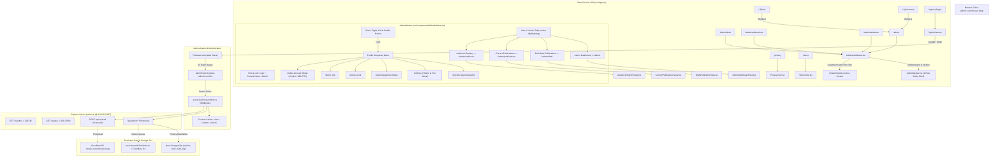

# ARCHITECTURE_FLOW.md — Visual System State

```mermaid
graph TD
    Client["Browser Client (admin.currentnews.blog)"]
    
    subgraph FrontendRoutes["React Router SPA (src/App.tsx)"]
        RootRoute["/ (Root)"] -->|Redirect| AdminRoute["/admin"]
        Wildcard["/* (Unknown)"] -->|Redirect| AdminRoute
        
        AdminRoute --> Guard["AdminAuthGuard.tsx"]
        DraftRoute["/admin/draft"] --> Guard
        PubsRoute["/admin/publications"] --> Guard
        AudienceRoute["/admin/audience"] --> Guard
        
        SignInRoute["/signin (/login)"] --> SignInView["SignInView.tsx"]
        PrivacyRoute["/privacy"] --> PrivacyView["PrivacyView.tsx"]
        TermsRoute["/terms"] --> TermsView["TermsView.tsx"]
        
        Guard -->|Authenticated & Verified| AdminNav["AdminNavbar.tsx (2-Row Sticky Shell)"]
        Guard -->|Unauthenticated / No Role| BlockScreen["Unauthorized Lockout Screen"]
        
        subgraph AdminNavbarShell["AdminNavbar (src/components/AdminNavbar.tsx)"]
            Row1Left["Row 1 Left: Logo + 'Current News - Admin'"]
            Row1Right["Row 1 Right: Circle Profile Button"]
            
            Row1Right -->|Click| ProfileMenu["Profile Dropdown Menu"]
            ProfileMenu --> SignOutAction["Sign Out (signOut(auth))"]
            ProfileMenu --> SettingsModal["Settings (Theme & Pen Name)"]
            ProfileMenu --> LikedModal["Liked Dispatches Modal"]
            ProfileMenu --> PrivacyLink["/privacy Link"]
            ProfileMenu --> TosLink["/terms Link"]
            ProfileMenu --> DeleteModal["Delete Account Modal (Confirm 'DELETE')"]
            
            Row2Tabs["Row 2: Action Tabs (Active Highlighting)"]
            Row2Tabs --> TabDash["Admin Dashboard -> /admin"]
            Row2Tabs --> TabDraft["Draft New Publications -> /admin/draft"]
            Row2Tabs --> TabPubs["Current Publications -> /admin/publications"]
            Row2Tabs --> TabAudience["Audience Registry -> /admin/audience"]
        end
        
        TabDash --> Dashboard["AdminDashboardView.tsx"]
        TabDraft --> Draft["DraftPublicationView.tsx"]
        TabPubs --> Pubs["CurrentPublicationsView.tsx"]
        TabAudience --> Audience["AudienceRegistryView.tsx"]
    end
    
    subgraph AuthLayer["Authentication & Authorization"]
        FirebaseAuth["Firebase Auth (Web Client)"]
        TokenRefresh["adminFetch.ts (Auto-refresh on 401)"]
        RequireRole["server/auth/requireRole.ts Middleware"]
        CustomClaims["Custom Claims: role in ['admin', 'writer']"]
        
        SignInView -->|Google / Email| FirebaseAuth
        FirebaseAuth -->|ID Token Bearer| TokenRefresh
        TokenRefresh -->|Bearer Token| RequireRole
        RequireRole --> CustomClaims
    end
    
    subgraph BackendServer["Express Server (server.ts @ 0.0.0.0:PORT)"]
        HealthProbe["GET /healthz -> 200 OK"]
        ReadyProbe["GET /readyz -> 200 JSON"]
        
        AdminAPI["/api/admin/* (Protected)"]
        UploadAPI["POST /api/upload (Protected)"]
        
        RequireRole --> AdminAPI
        RequireRole --> UploadAPI
    end
    
    subgraph DataTier["Persistent Data & Storage Tier"]
        NeonDB["Neon PostgreSQL (articles, staff, audit_log)"]
        R2Storage["Cloudflare R2 (media.currentnews.blog)"]
        D1Sync["server/sync/d1Publisher.ts -> Cloudflare D1"]
        
        AdminAPI -->|Primary Read/Write| NeonDB
        AdminAPI -->|Outbox Queue| D1Sync
        UploadAPI -->|S3 Upload| R2Storage
    end
```
